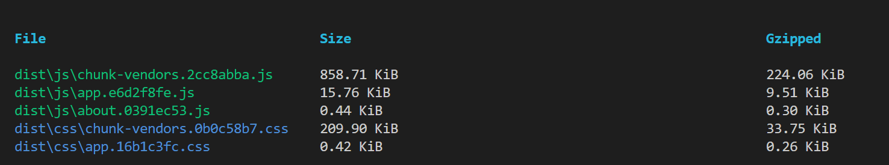
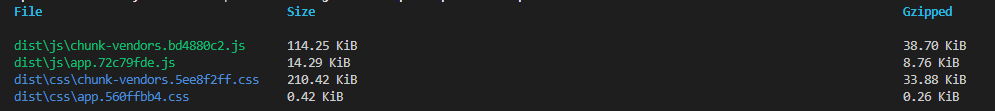

## 首屏渲染优化
首先，我们需要了解一下`首屏渲染`是个什么东西

大家可以这么想象一下——

> 现在你输入了一个url到浏览器，按下了回车，浏览器开始跳转，标签页上的小图标开始加载，但是目前页面仍然一片空白。

像上面这种场景我们碰到过非常多。有的时候空白的时间长，有的时候空白的时间短，那很明显空白时间长的网页体验相对来说并不好。

不好的纬度非常多元，有首屏内容渲染（FCP）、最大内容渲染（LCP）、总共阻塞时长（TBT）等等的判断指标， `Lighthouse`一共设置了大概6项指标，而根据`Lighthouse`自身版本的不同，对其权重的设置也不一样，我们再这里放上两张图，具体的东西不再赘述


在这里我们使用MDN官网对首屏渲染的定义（目前中文只有机翻所以直接使用英文原文吧）

> **First Contentful Paint** (FCP) is when the browser renders the first bit of content from the DOM, providing the first feedback to the user that the page is actually loading. The question "Is it happening?" is "yes" when the first contentful paint completes.

> **The First Contentful Paint** time stamp is when the browser first rendered any text, image (including background images), video, canvas that had been drawn into, or non-empty SVG. This excludes any content of iframes, but includes text with pending webfonts. This is the first time users could start consuming page content.  

### 示例项目初始化
那么接下来在我们谈优化的方法之前，先直接使用[`vue-cli`](https://cli.vuejs.org/zh/guide/)去初始化一个项目  
```shell
vue create vue-fcp-example
```

主要配置如下所示

```shell
Vue CLI v5.0.8
? Please pick a preset: Manually select features
? Check the features needed for your project: Babel, Router, Vuex, Linter
? Choose a version of Vue.js that you want to start the project with 2.x
? Use history mode for router? (Requires proper server setup for index fallback in production) Yes
? Pick a linter / formatter config: Standard
? Pick additional lint features: Lint on save, Lint and fix on commit
? Where do you prefer placing config for Babel, ESLint, etc.? In dedicated config files
```
如果出现pnpm报错的话，全局搜索找到`.vuerc`文件，然后将packageManager字段由pnpm改为npm

鉴于平常我们除了上述的vue相关的生态，仍然需要`axios`、`element-ui`这样的库/框架，因此这里也进行安装与引入
```bash
npm install element-ui axios
```

如果出现依赖版本不匹配的报错，可以加上`--legacy-peer-deps`的后缀

到此为止我们就完成了最基础的需求了，然后我们来看下此时`main.js`以及`App.vue`长什么样子
```js
//main.js
import Vue from 'vue'
import App from './App.vue'
import router from './router'
import store from './store'
import ElementUI from 'element-ui'
import 'element-ui/lib/theme-chalk/index.css'
Vue.config.productionTip = false

Vue.use(ElementUI)

new Vue({
  router,
  store,
  render: h => h(App)
}).$mount('#app')

```

```vue
<!-- app.vue -->
<template>
  <div id="app">
    <nav>
      <router-link to="/"><el-button type="primary">Home</el-button></router-link> |
      <router-link to="/about"><el-button type="primary">About</el-button></router-link>
    </nav>
    <router-view/>
  </div>
</template>

<style>
#app {
  font-family: Avenir, Helvetica, Arial, sans-serif;
  -webkit-font-smoothing: antialiased;
  -moz-osx-font-smoothing: grayscale;
  text-align: center;
  color: #2c3e50;
}

nav {
  padding: 30px;
}

nav a {
  font-weight: bold;
  color: #2c3e50;
}

nav a.router-link-exact-active {
  color: #42b983;
}
</style>

```

这个时候，`npm run dev`之后的页面大概如下图所示  

  

我们可以看到其实页面上并没有什么东西，只是引入了`element-ui`的`el-button`，配合使用了`vue-router`而已。  

那么我们可以运行`npm run build`然后来看下打包文件的大小  

  

可以看到就这么小的一个项目，打包出来的js文件居然足足有800+k，css也有200+k，这是不能忍受的。  

如果直接将这样的项目放到一个小水管服务器（此处以我的服务器为例），那么使用F12和`Lighthouse`或者是[pagespeed](https://pagespeed.web.dev/)进行评测，大概能够看到它的性能指标数据如下图所示  

  

可以看到目前的这个数据非常不理想，无论是`FCP`还是`LCP`的数据都低得令人发指。无论是作为用户还是开发者，我个人认为都是比较难以接受的。  

那既然如此，我们就来说几个`Vue`项目中经常使用到首屏加载的优化的方法  

### 路由懒加载/动态导入
现在我们先来回想一下平常在路由里面我们会怎么添加一个路由
```js
import Vue from 'vue'
import VueRouter from 'vue-router'
import SomeView from '@/view/someview/index.vue' // 引入组件
Vue.use(VueRouter)

const routes = [
  ...
  { // 注册路由
    path: '/some-view',
    component: SomeView
  }
  ...
]

const router = ...

export default router
```
我们会直接引入这个组件，然后在路由中注册一个对应的路径，该路径下会渲染该组件。  

那其实我们有个别的加载路由组件的方法，相信很多小伙伴也有了解了，也就是[路由懒加载](https://router.vuejs.org/zh/guide/advanced/lazy-loading.html)  

默认情况下，我们现在的`/router/index.js`文件应该如下所示  
```js
...
const routes = [
  {
    path: '/',
    name: 'home',
    component: HomeView // 直接注册的组件
  },
  {
    path: '/about',
    name: 'about',
    // route level code-splitting
    // this generates a separate chunk (about.[hash].js) for this route
    // which is lazy-loaded when the route is visited.
    component: () => import(/* webpackChunkName: "about" */ '../views/AboutView.vue') // 懒加载注册的组件
  }
]
...
```
可以看到`HomeView`和`AboutView`的注册方式是不同的  

我们来仔细观察一下这两者的区别
```js
import A from 'A.vue'
const A = () => import('A.vue')
```
小伙伴们能看出上面两种引入的区别吗？  

没错，第一种是直接引入了一个组件(Module)，第二种是一个引入的方法，该方法返回一个import函数。  

这也就是路由懒加载的操作。  

刚刚应该已经有眼尖的小伙伴发现了，在上面的打包文件的截图中，除了常见到的`chunk-vendor.js`以及`app.js`，还包含了一个`about.js`


如果我们将`/router/index.js`改成下面的样子，打包出来的文件也会有相应的区别
```js
  ...
  {
    path: '/about',
    name: 'about',
    component: AboutView
  }
  ...
```


Vue-router官网文档是建议对所有的路由都使用动态导入的，但是具体需不需要这样做，要看团队是否有通过该方法优化包大小的体积。  

因为当你将所有路由都改为动态引入之后，实际上每进一个新页面就会加载一个js，那么接下来就会造成两个问题
1. 这新载入的js又是一次渲染，对于网速一般的用户而言，他除了第一次进App要等，之后每次切换页面都需要等待新加载的js请求完毕并执行，这在时间上又是一笔不小的开销。
2. 有可能因为缓存等原因造成路由文件加载不出来，并报`Loading Chunk Failed`的报错，这时候我们也需要在路由中注册一个监听方法帮助我们解决该问题
```js
// /router/index.js
/* 路由异常错误处理，尝试解析一个异步组件时发生错误，重新渲染目标页面 */
router.onError((error) => {
  const pattern = /Loading chunk (\d)+ failed/g
  const isChunkLoadFailed = error.message.match(pattern)
  const targetPath = router.history.pending.fullPath
  if (isChunkLoadFailed) {
    router.replace(targetPath)
  }
})
```

### 分析依赖大小，按需加载
说实在的，一次性引入所有路由确实是一笔开销，但是我们手写的各个`.vue`文件加起来可能也不会太大，那么这个时候我们一定会想知道到底是什么玩意儿这么大，那就让我们先来分析一下  

#### 安装`webpack-bundle-analyzer`
使用`webpack`进行构建的项目都可以安装一个这个插件，使用方法也很简单
1. 安装插件
```shell
npm install --save-dev webpack-bundle-analyzer
```
2. 去进行webpack相应的配置
```js
//vue.config.js
const { defineConfig } = require('@vue/cli-service')
const { BundleAnalyzerPlugin } = require('webpack-bundle-analyzer')
const IS_PROD = process.env.NODE_ENV === 'production'
module.exports = defineConfig({
  transpileDependencies: true,
  chainWebpack: (config) => {
    if (IS_PROD) {
      config.plugin('webpack-bundle-analyzer')
        .use(new BundleAnalyzerPlugin(
          {
            analyzerMode: 'static', // 可选值有server static disabled
            generateStatsFile: false,
            statsOptions: { source: false },
            openAnalyzer: false
          }
        ))
    }
  }
})

```
3. （可选）去`package.json`中给build指令添加操作符`--report`
```json
  "scripts": {
    ...
    "build": "vue-cli-service build --report",
    ...
  },
```
4. 运行`npm run build`查看效果

到了这一步，我们再进行打包之后就会看到`dist`文件夹下多出来了一个`report.html`文件，双击打开它，我们会看到打包出来的文件各个依赖占比

从图片中我们可以看到，`element-ui`真的太大了朋友们。这整个js就800+kb，一个element-ui就占了500+k。  

而且，最大的问题是，我们只是使用了一个`el-button`而已啊！  

至不至于啊！  

ok，那既然如此，我们就来进行按需加载

#### 按需引入
以下的方法仅针对`element-ui`，部分场景可能
1. 安装`babel-plugin-component`
```shell
npm install babel-plugin-component -D
```
2. 修改`babel.config.js`配置如下
```js
// babel.config.js
module.exports = {
  presets: [
    ['@babel/preset-env', { modules: false }]
  ],
  plugins: [
    [
      'component',
      {
        libraryName: 'element-ui',
        styleLibraryName: 'theme-chalk'
      }
    ]
  ]
}

```
3. 注释掉原来`main.js`中的引入
```js
//main.js
// import ElementUI from 'element-ui'
import 'element-ui/lib/theme-chalk/index.css' // css需要保留
// Vue.use(ElementUI)
```
4. 方法一：`main.js`中注册需要得组件
```js
import { Button, Dialog } from 'element-ui'
Vue.use(Button)
Vue.use(Dialog)
...
```
5. 方法二：在使用到的组件中进行对应`element-ui`组件的引入
```vue
<!-- App.vue -->
<template>
  <div id="app">
    <nav>
      <router-link to="/"><Button type="primary">Home</Button></router-link> |
      <router-link to="/about"><Button type="primary">About</Button></router-link>
    </nav>
    <router-view/>
  </div>
</template>

<script>
import { Button } from 'element-ui'
export default {
  components: {
    Button
  }
}
</script>
```
6. 打开页面看看效果，此时`element-ui`样式得按钮仍然能够正常显示
7. 再次进行`npm run build`

朋友们！看看这大小！革命成功了！  

这个时候我们再打开`report.html`，就能看到之前大得离谱得`element-ui`已经消失不见了


### 开启gzip

### cdn引入依赖
### 切分打包文件数量

### 字体保持可见

### SSR方案 