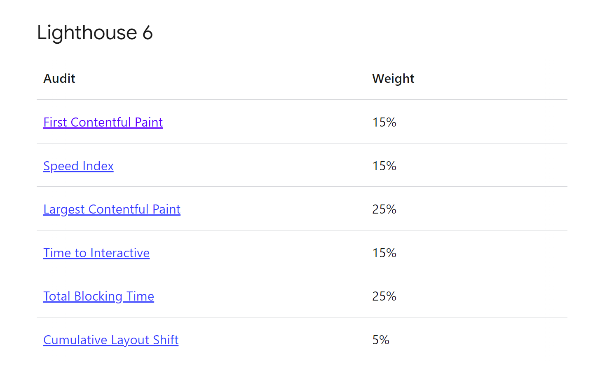
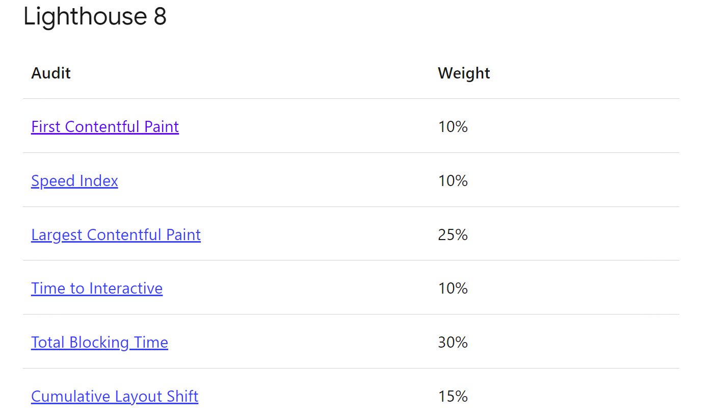
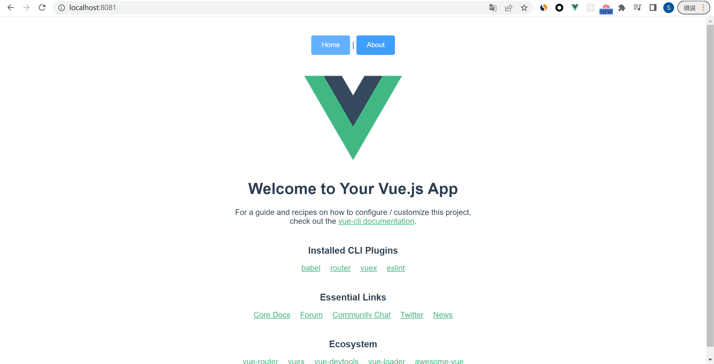
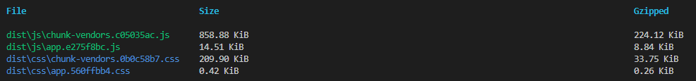
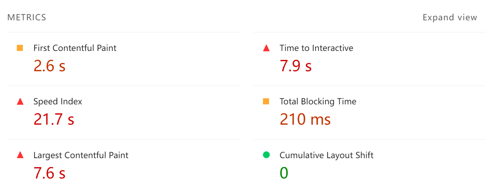

## 首屏渲染优化
首先，我们需要了解一下`首屏渲染`是个什么东西

大家可以这么想象一下——

> 现在你输入了一个url到浏览器，按下了回车，浏览器开始跳转，标签页上的小图标开始加载，但是目前页面仍然一片空白。

像上面这种场景我们碰到过非常多。有的时候空白的时间长，有的时候空白的时间短，那很明显空白时间长的网页体验相对来说并不好。

不好的纬度非常多元，有首屏内容渲染（FCP）、最大内容渲染（LCP）、总共阻塞时长（TBT）等等的判断指标， `Lighthouse`一共设置了大概6项指标，而根据`Lighthouse`自身版本的不同，对其权重的设置也不一样，我们再这里放上两张图，具体的东西不再赘述




在这里我们使用MDN官网对首屏渲染的定义（目前中文只有机翻所以直接使用英文原文吧）

> **First Contentful Paint** (FCP) is when the browser renders the first bit of content from the DOM, providing the first feedback to the user that the page is actually loading. The question "Is it happening?" is "yes" when the first contentful paint completes.

> **The First Contentful Paint** time stamp is when the browser first rendered any text, image (including background images), video, canvas that had been drawn into, or non-empty SVG. This excludes any content of iframes, but includes text with pending webfonts. This is the first time users could start consuming page content.  

### 项目初始化
那么接下来在我们谈优化的方法之前，先直接使用[`vue-cli`](https://cli.vuejs.org/zh/guide/)去初始化一个项目  
```shell
vue create vue-fcp-example

项目配置选择Default Vue2、Vue-router、Vuex、eslint为standard

如果出现pnpm报错的话，全局搜索找到`.vuerc`文件，然后将packageManager字段由pnpm改为npm

```

鉴于平常我们除了上述的vue相关的生态，仍然需要`axios`、`element-ui`这样的库/框架，因此这里也进行安装与引入
```bash
npm install element-ui axios
```

到此为止我们就完成了最基础的需求了，然后我们来看下此时`main.js`以及`App.vue`长什么样子
```js
//main.js
import Vue from 'vue'
import App from './App.vue'
import router from './router'
import store from './store'
import ElementUI from 'element-ui'
import 'element-ui/lib/theme-chalk/index.css'
Vue.config.productionTip = false

Vue.use(ElementUI)

new Vue({
  router,
  store,
  render: h => h(App)
}).$mount('#app')

```

```vue
<!-- app.vue -->
<template>
  <div id="app">
    <nav>
      <router-link to="/"><el-button type="primary">Home</el-button></router-link> |
      <router-link to="/about"><el-button type="primary">About</el-button></router-link>
    </nav>
    <router-view/>
  </div>
</template>

<style>
#app {
  font-family: Avenir, Helvetica, Arial, sans-serif;
  -webkit-font-smoothing: antialiased;
  -moz-osx-font-smoothing: grayscale;
  text-align: center;
  color: #2c3e50;
}

nav {
  padding: 30px;
}

nav a {
  font-weight: bold;
  color: #2c3e50;
}

nav a.router-link-exact-active {
  color: #42b983;
}
</style>

```

这个时候，`npm run dev`之后的页面大概如下图所示  

  

我们可以看到其实页面上并没有什么东西，只是引入了`element-ui`的`el-button`，配合使用了`vue-router`而已。  

那么我们可以运行`npm run build`然后来看下打包文件的大小  

  

可以看到就这么小的一个项目，打包出来的js文件居然足足有800+k，css也有200+k，这是不能忍受的。  

如果直接将这样的项目放到一个小水管服务器（此处以我的服务器为例），那么使用F12和`Lighthouse`或者是[pagespeed](https://pagespeed.web.dev/)进行评测，大概能够看到它的性能指标数据如下图所示  

  

可以看到目前的这个数据非常不理想，无论是`FCP`还是`LCP`的数据都低得令人发指。无论是作为用户还是开发者，我个人认为都是比较难以接受的。  

那既然如此，我们就来说几个`Vue`项目中经常使用到首屏加载的优化的方法  

### cdn引入依赖

### 开启gzip

### 路由懒加载

### 按需加载

### 切分打包文件数量

### SSR方案 